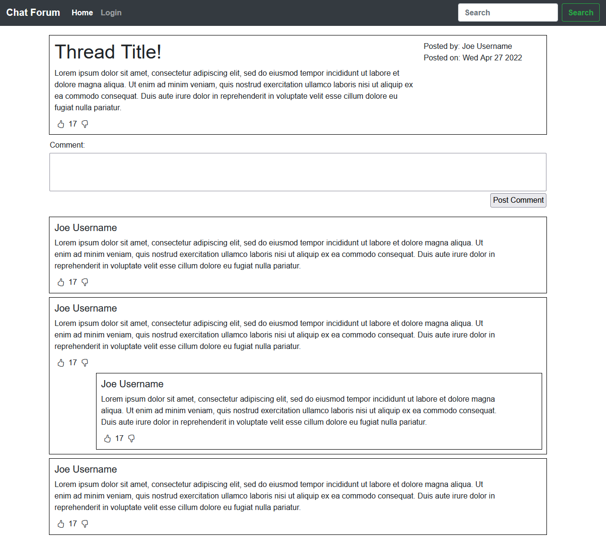

# CSCI 3230U - Final Project

## Chat Forum

How to Run

1. Launch mongodb, run command: _mongod_
2. Open server file, install dependencies: _npm install_
3. Run command in server file: _node index.js_
4. Open client file, install dependencies: _npm install_
5. Install d3 dependencies: _npm install d3 --save_
6. Run command in client file: _npm run serve_

### Group 23

| Group Member Name |           GitHub Username (GitHub URL)            |
| :---------------: | :-----------------------------------------------: |
|     Thinh Le      |    [ThinhLe188](https://github.com/ThinhLe188)    |
|     Tony Ling     |     [Tony-Ling](https://github.com/Tony-Ling)     |
|   William Dolan   | [Will-Dolan-VI](https://github.com/Will-Dolan-VI) |
|     Kevin Lau     |    [Kevinlau24](https://github.com/KevinLau24)    |
|    John Tovera    |   [John-Tovera](https://github.com/John-Tovera)   |

[Independent.Study.Web.App.Dev.pdf](https://github.com/ThinhLe188/csci3230u_chat-forum/files/8577691/Independent.Study.Web.App.Dev.pdf)

A Thread page exists but can't be accessed normally because the home page doesn't populate. 
You can find it here: http://localhost:8080/thread/?id=626a0a38cdcf388e4aa2263e

Because of an API issue the replies don't display, though the code is already there.
This is how the page appears with data hard-coded in:
